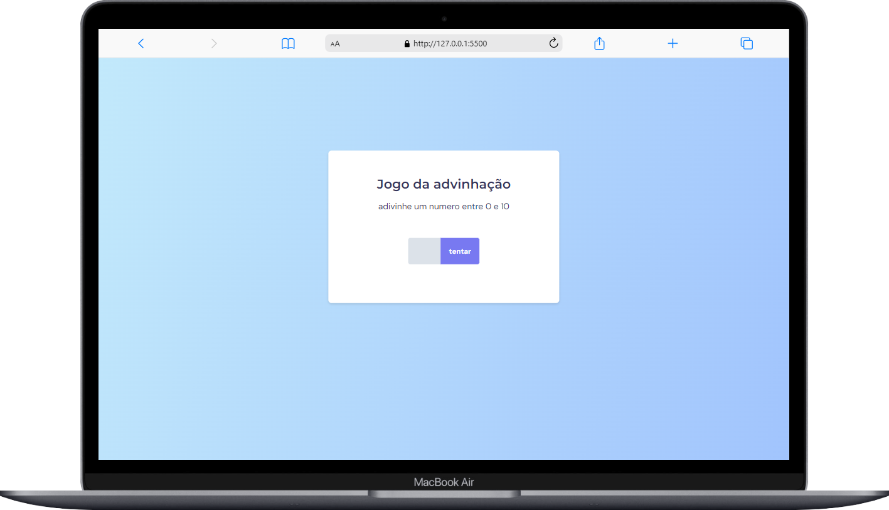
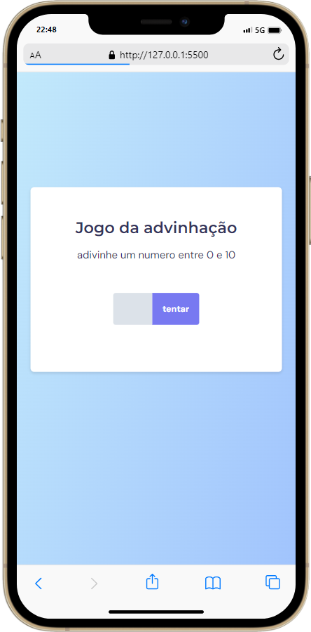

<h1 align="center">Jogo Da Memoria Simples
</h1>

## 🚀 Tecnologias

Esse projeto foi desenvolvido com as seguintes tecnologias:

- HTML
- CSS
- JavaScript

## 💻 Projeto

um jogo de adivinhar um numero de 0 a 10 de logica e layout simples

## sobre

Esse projeto foi feito apartir do aprendizado da maratona Explorer da rocketseat

## imagens do projeto

## imagens do projeto em display menores

    
    
    

